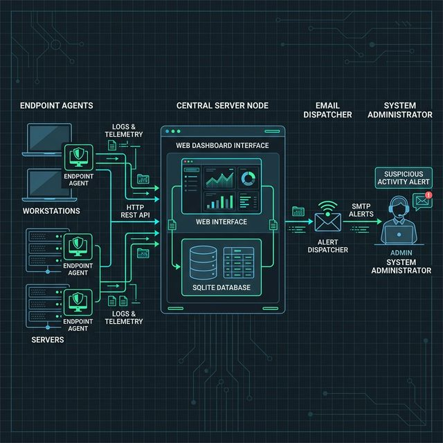

# Intrusion Detection System — Detailed Explanation and Run Guide

## Project Overview
This repository implements an Intrusion Detection System (IDS) that detects malicious network activity from packet/flow data using supervised machine learning (or hybrid rule+ML). It supports training models from labeled datasets and running detection in batch or streaming modes.

## Core Architecture & Components
This system relies on a central management dashboard and lightweight endpoint agents.

- **Central Server (`web-ids/app.py`):** Acts as the core platform providing the web UI to administrative users. It listens for telemetry via REST API and stores data locally.
- **SQLite Database (`ids.db`):** Local relational database storing registered users, alert records, and IDS commands.
- **IDS Agent (`ids_agent.py`):** A standalone script installed across your Linux endpoints (including the server itself). It natively watches logs, files, and processes. It communicates directly with the Server via an API Key.
- **Email Alert Dispatcher (`alert.py`):** Processes high-severity alerts stored in the database and dispatches HTML emails using SMTP to the registered administrator.
- **Intrusion Prevention System (IPS):** The lightweight agent continuously polls the central dashboard to receive manual commands (e.g., Block IP using `iptables`, kill malicious processes via `kill -9`).

## Data & Recommended Datasets
Use labeled network datasets such as:
- CICIDS2017 / CIC-IDS2018
- NSL-KDD (smaller, useful for testing)
- UNSW-NB15
Prepare a CSV/Parquet of features per flow or per time-window. Required columns typically include: src_ip, dst_ip, src_port, dst_port, proto, duration, packet_count, byte_count, plus engineered features.

## Installation
Prerequisites:
- Python 3.8+
- pip, virtualenv (recommended)
- (Optional) GPU for deep-learning models

Quick install:
- Create virtual env:
  python -m venv .venv
  source .venv/bin/activate
- Install dependencies:
  pip install -r requirements.txt

(If requirements.txt is not present, add commonly used packages: pandas, scikit-learn, xgboost, numpy, joblib, scapy, pyshark, tqdm)

## Data Preparation
1. Place raw dataset under data/raw/ (e.g., pcap files or CSVs).
2. Run preprocessing:
   - python src/preprocess.py --input data/raw/ --output data/processed/
   This should:
   - extract flows (if pcap): e.g., using Zeek or a flow exporter
   - compute features (duration, packet counts, statistical features)
   - encode labels and save train/test splits

Expected outputs: data/processed/train.csv, data/processed/test.csv

## Distributed Architecture Diagram



```mermaid
graph TD
    subgraph "Endpoints / Hosts (Run ids_agent.py)"
        Agent[IDS Agent Script]
        Agent -- Monitors --> Files[File System \n /etc]
        Agent -- Monitors --> Procs[Running Processes]
        Agent -- Monitors --> Auth[Auth Logs \n journalctl]
        Agent -- Modifies --> IPS[Firewall / iptables \n IPS Action]
    end

    subgraph "Central Server Node (Docker web-ids)"
        API[Flask REST API]
        DB[(SQLite ids.db)]
        WebUI[Dashboard UI]
        Alerts[Email Dispatcher \n alert.py]
    end
    
    Admin((System Admin))

    Agent -- "Telemetry & Alerts \n (HTTP POST)" --> API
    Agent <-- "Polls for Commands \n (HTTP GET)" --> API
    
    API <--> DB
    WebUI <--> DB
    Alerts <-- "Reads Settings" -- DB
    
    API -- "High Severity Alert" --> Alerts
    
    Admin -- "Views & Manages" --> WebUI
    Alerts -- "Sends Warnings" --> Admin
```
